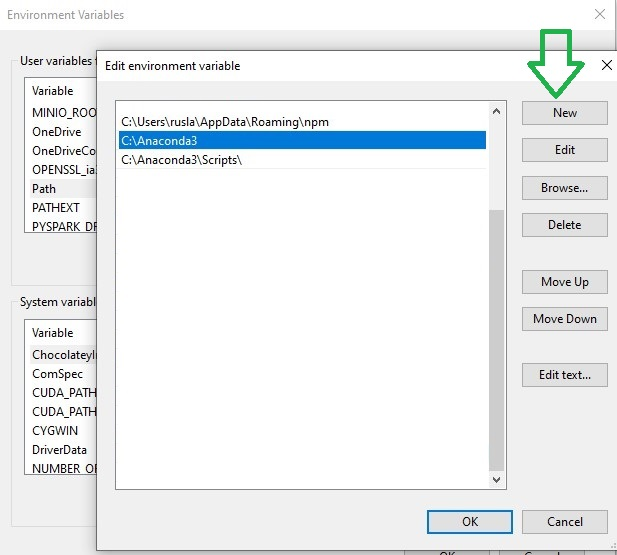

# How to Extract Text from PDF to Audio


In this blog post I will show you how  **Extract Text from PDF**  and  **convert to mp3**.


Sometimes you have some pdfs that you want to listen.  I will explain you how to install an environment in python with Anaconda and create a program that allows you read the pdf and then covert it to mp3.

We are going to use the pdf miner library however also it is possible to convert the pdf to image and then use the OCR recognition, that is useful when  the pdf is built from  scanned pages 


### Installation of Conda

First you need to install anaconda at this [link](https://www.anaconda.com/products/individual)


in this location **C:\Anaconda3** , then you, check that your terminal , recognize **conda**

```
C:\conda --version
conda 4.12.0
```

If says ‘conda’ is not recognized as an internal or external command.

You can try this: for me, I installed anaconda3 into `C:\Anaconda3`.

Therefore you need to add `C:\Anaconda3` as well as `C:\Anaconda3\Scripts\` to your path variable, e.g.

```
set PATH=%PATH%;C:\Anaconda3;C:\Anaconda3\Scripts\
```

Or simply fix with adding the **Environment Variable**


and edit the **Path** with a **New** , and add the `C:\Anaconda3` and `C:\Anaconda3\Scripts\` and `C:\Anaconda3\Library\bin` , this last one for the download libraries from internet.



Some times if you got the problem of HTTP 000 Connection, you can copy the files libcrypto-1_1-x64.dll libssl-1_1-x64.dll from c:\Anaconda3\Library\bin to c:\Anaconda3\DLLs.

## Environment creation

The environments supported that I will consider is Python 3.7, 

I will create an environment called **pdfextract**, but you can put the name that you like.

```
conda create -n pdfextract python==3.7
```

If you are running anaconda for first time, you should init conda with the shell that you want to work, in this case I choose the cmd.exe

```
conda init cmd.exe
```

and then close and open the terminal

```
conda activate pdfextract
```

You will have something like this:

```
Microsoft Windows [Version 10.0.19044.1706]
(c) Microsoft Corporation. All rights reserved.
C:\Users\ruslanmv>conda activate pdfextract
(pdfextract) C:\Users\ruslanmv>
```

then in your terminal type the following commands:

```
conda install ipykernel
```

then

```
python -m ipykernel install --user --name pdfextractor --display-name "Python (Pdf-Extractor)"
```


You can install the PDFMiner library easily using the pip command.

```bash
pip install pdfminer
```

and for the text to audio conversion we will use the following libraries

```
pip install gTTS pyttsx3
```

optionally you can install the following OCR library 

```
pip install pytesseract
```

let us create a folder, if you are in windows

```
mkdir  pdfapp
```

```
cd  pdfapp
```

then open the **Jupyter notebook** with the command

```
jupyter notebook&
```

then click New and Select your Kernel called **Python ( Pdf-Extractor)** 

After that, create a new  notebook


# Extraction of text

Now is time to build the program, once is created the notebook,  copy paste the following code

```python
import io 
from pdfminer.converter import TextConverter 
from pdfminer.pdfinterp import PDFPageInterpreter 
from pdfminer.pdfinterp import PDFResourceManager 
from pdfminer.pdfpage import PDFPage 
from gtts import gTTS
import os
import IPython
import pyttsx3

def extract_text_by_page(pdf_path): 

    with open(pdf_path, 'rb') as fh: 
        
        for page in PDFPage.get_pages(fh, 
                                    caching=True, 
                                    check_extractable=True): 
            
            resource_manager = PDFResourceManager() 
            fake_file_handle = io.StringIO() 
            
            converter = TextConverter(resource_manager, 
                                    fake_file_handle) 
            
            page_interpreter = PDFPageInterpreter(resource_manager, 
                                                converter) 
            
            page_interpreter.process_page(page) 
            text = fake_file_handle.getvalue() 
            
            yield text 
            
            # close open handles 
            converter.close() 
            fake_file_handle.close() 
def extract_text(pdf_path): 
    for page in extract_text_by_page(pdf_path): 
        print(page)
        
def extract_all(pdf_path): 
    text=""
    for page in extract_text_by_page(pdf_path): 
        text=text+page    
    return text   
# Offline convertor
def pdf_to_mp3_v1(pdf_path): 
    extract_text(pdf_path)
    # The text that you want to convert to audio
    mytext = extract_all(pdf_path)
    # On linux make sure that 'espeak' and 'ffmpeg' are installed
    # init function to get an engine instance for the speech synthesis
    engine = pyttsx3.init()
    # get the available voices 
    voices = engine.getProperty('voices')
    # change the speech rate
    engine.setProperty('rate',178)
    # choose a voice based on the voice id
    engine.setProperty('voice',voices[0].id) # Selected  Voice    
    engine.save_to_file(mytext, 'audio1.mp3')
    engine.runAndWait()
# Online convertor
def pdf_to_mp3_v2(pdf_path): 
    extract_text(pdf_path)
    # The text that you want to convert to audio
    mytext = extract_all(pdf_path)
    # Language in which you want to convert
    language = 'en'
    # Passing the text and language to the engine,
    # here we have marked slow=False. Which tells
    # the module that the converted audio should
    # have a high speed
    myobj = gTTS(text=mytext, lang=language, slow=False)
    # Saving the converted audio in a mp3 file named
    # welcome
    myobj.save("audio2.mp3")
```

 Please note that, you need to change the path of the PDF file.

```
print(extract_text('Sail.pdf'))
```

you will get something like


In ordering to convert to mp3 simply you can use

```
pdf_to_mp3_v1('Sail.pdf')
```


which you don't requiere an internet connection.

If you want a little more natural voice you can use.

